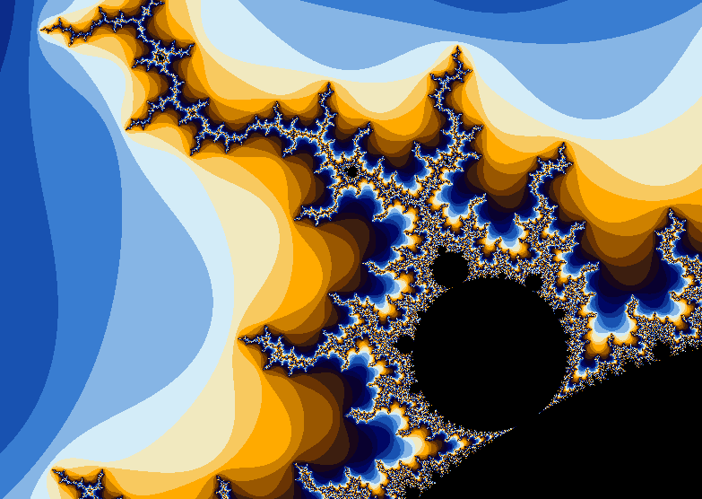
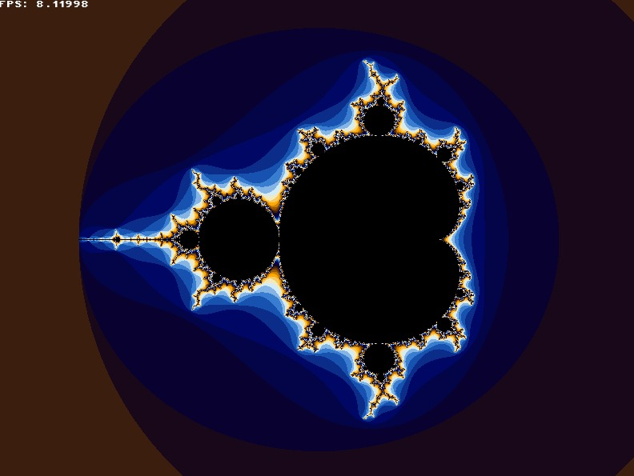
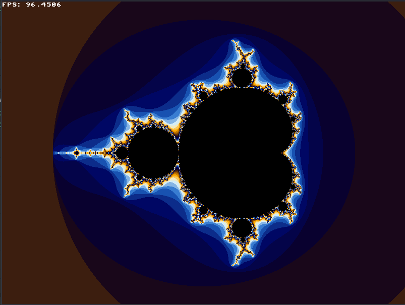

# Drawing the Mandelbrot Set with SFML

This is a simple C++ program that uses SFML to draw the Mandelbrot set. The Mandelbrot set is a fractal that is created by iterating a complex function on a complex number and determining whether the result remains within a certain boundary. The resulting set is a complex boundary that exhibits self-similarity at different scales.

## Picture of the Mandelbrot set


## Advantages of using SIMD AVX over compiler flags

Compiler optimization flags can be very useful for improving the performance of a program. These flags instruct the compiler to optimize the code generated by the compiler in various ways, such as inlining functions, removing unnecessary code, and optimizing loops. However, there are limitations to what compiler optimization flags can achieve.

First, optimization flags may not take into account the specific hardware features of the machine the program is running on. For example, a processor may have support for SIMD instructions like AVX that can be used to perform certain calculations much faster than traditional scalar operations. However, the compiler may not be aware of these features and may not generate code that takes advantage of them.

Second, optimization flags may not be able to fully optimize the code. There may be limitations to what optimizations the compiler can perform, such as avoiding certain optimizations that could change the behavior of the program.

In contrast, using explicit SIMD instructions like AVX can give the programmer more control over how the program is optimized, allowing for potential for greater performance gains. Additionally, SIMD instructions can be specifically designed for parallel operations, making them particularly useful for certain types of computations.

Overall, while compiler optimization flags can be very useful, they have limitations and may not always be enough to achieve optimal performance. By using specific hardware features like SIMD instructions, programmers can potentially achieve even greater performance gains. 

## Dependencies

This program requires SFML to be installed on your system. You can download SFML from the official website: https://www.sfml-dev.org/download.php

## Build and run

First of all, download this repository:
```bash
git@github.com:mr-gukas/MyMandelbrot.git
cd MyMandelbrot
```
Then you can choose the branch you want:
```bash
git checkout sse    \\ for version with AVX2
git checkout no_sse \\ for version without AVX2
```
Compile the program using CMake: 
```bash
mkdir build 
cd build 
cmake ..
make
```
Run the program:
```bash 
./frac 
```

You can also choose on of compiler optimization flags. Write them in "CMakeLists.txt". For example::
```bash
add_compile_options(-Ofast)
```
## Camera motion

You can move around the fractal using the hot keys: 1) use classic WASD for for vertical and horizontal forward motion; 2) use J for zoom in and K for zoom out;

## Results

**FPS rate:**

| Optimization key | No optimizations | AVX2 float  | 
|------------------|------------------|-------------|
|       None       |        6         |      25     |
|       -Ofast     |        15        |      94     |

|  |
|:--:|
| <b>Screenshot of the version that does not use SIMD</b>|

|  |
|:--:|
| <b>Screenshot of the version that uses SIMD</b>|

## Conclusion
We observe a speedup of the program by 6-7 times when using SIMD AVX.
By utilizing SIMD AVX instructions in our image processing program, we were able to achieve a significant improvement in performance compared to non-SIMD implementations. This approach offers advantages over relying solely on compiler optimization flags, including greater control over program behavior and potential for greater performance gains.
